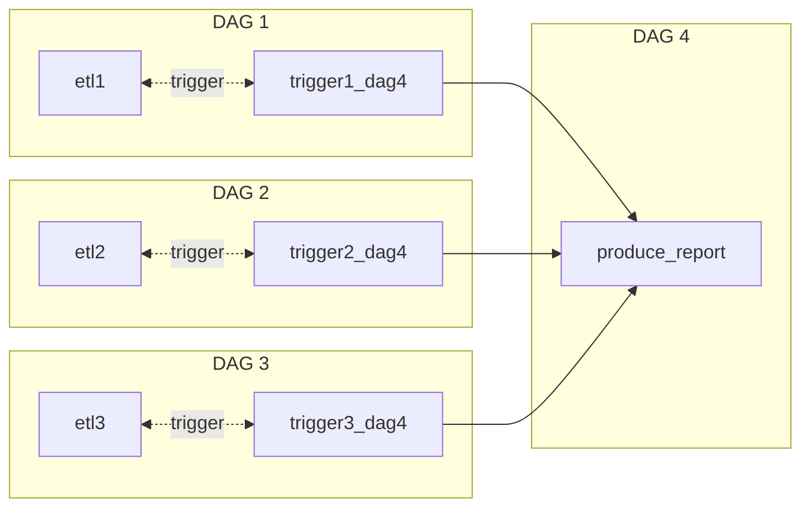

<!-- omit in toc -->
# Introduction
Take notes of parameters involved in Airflow.

 

<!-- omit in toc -->
# Table of Contents
- [Fundamental Concepts](#fundamental-concepts)
- [API](#api)
  - [Operators](#operators)
    - [PythonOperator](#pythonoperator)
    - [EmptyOperator](#emptyoperator)
    - [TriggerDagRunOperator](#triggerdagrunoperator)
    - [Operators for Cloud Servers](#operators-for-cloud-servers)
  - [Rules of Tasks](#rules-of-tasks)
    - [atomicity](#atomicity)
    - [Idempotent](#idempotent)
- [Technical Plans](#technical-plans)
    - [1. Is the data processed again at some other time in the future?](#1-is-the-data-processed-again-at-some-other-time-in-the-future)
    - [2. How do I receive the data? Frequency, size, format, source type](#2-how-do-i-receive-the-data-frequency-size-format-source-type)
    - [3. What are we going to build with the data](#3-what-are-we-going-to-build-with-the-data)

 

# Fundamental Concepts

# API
* an interface to connect and send requests to other services
* e.g. API of cloud servers in Python
  |Cloud Server| API|
  |:---:|:---:|
  |AWS|boto3|
  |GCP|Cloud SDK|
  |Azure|Azure SDK for Python|
    

 

## Operators
* most operators are **installed** by separate **pip packages**
  > apache-airflow-providers-*
* can internally handle the technical implementation
  > that is why many features using operators 

 

### PythonOperator
* python_callable  
python function which is callable
* template_fields= ['templates_dict', 'op_args', 'op_kwargs']

 

### EmptyOperator
* An Operator does nothing

 

### TriggerDagRunOperator

* trigger the next dag to run 
* if backfill, clearing TriggerDagRunOperators does not clear tasks in the triggered DAG, but a new DAG runs
  
 

### Operators for Cloud Servers
* an Airflow operator can communicate with the Cloud SDK by giving arguments
* required packages to be installed
  |Cloud|Install|
  |:---:|:---:|
  |AWS| pip install apache-airflow-providers-amazon |
  |GCP| pip install apache-airflow-providers-google |
  |Azure| pip install apache-airflow-providers-microsoft-azure |
  > The implementation of the AWS operator calls copy_object() on boto3

 

## Rules of Tasks
### atomicity
* should follow atomicity to make sure a task will not produce half work if the task failed. 
  
   
  e.g. a task includes writing data and sending mails if sending mails fails, but data already is stored in the local directory. 

* Solution
  split tasks into multiple tasks => make sure each task has only one purpose 

 

### Idempotent
* if a task is called several times, its output should be identical every time 

 

# Technical Plans
before building a pipeline, having a technical plan is required. Questions of Technical Plans are provided below:

### 1. Is the data processed again at some other time in the future?
### 2. How do I receive the data? Frequency, size, format, source type
### 3. What are we going to build with the data 