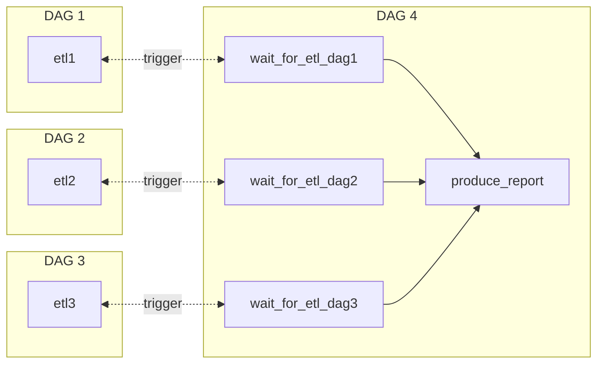

<!-- omit in toc -->
# Introduction
Trigger tasks by polling for certain conditions instead of waiting for a specific time 

<br />

<!-- omit in toc -->
# Table of Contents
- [Fundamental Concepts](#fundamental-concepts)
  - [Sensors](#sensors)
    - [Sensor deadlocks](#sensor-deadlocks)
  - [FileSensor](#filesensor)
  - [PythonSensor](#pythonsensor)
  - [ExternalTaskSensor](#externaltasksensor)
    - [Execution_delta](#execution_delta)
- [Commands](#commands)
  - [Start workflows with CLI](#start-workflows-with-cli)
  - [Start workflows with REST](#start-workflows-with-rest)

# Fundamental Concepts

## Sensors
* **continuously** poll for certain conditions to be true. If false, sensors will wait and try again until either the **condition** is true or a **timeout** is reached
* mode 
  * poke: take occupies a task slot as long as conditions of sensors are not met
  * reschedule: release the slot after it finished poking. Only occupy the task as doing actual work

### Sensor deadlocks
running sensor tasks waiting for a condition to be true occupy all airflow slots and affect the execution of other tasks (the entire system is stalled)

> Solution: argument **mode** in Sensor class


## FileSensor
* uses globbing (similar to regex) to match patterns against file or directory names
    
    data_files = test_path.glob('data-*.csv')


## PythonSensor
* return a Boolean value
  * true: the condition is met


## ExternalTaskSensor
* For inter-DAG dependencies, a sensor pokes the state of tasks in other DAGs



  * without this, only a sensor pokers the state of tasks in the same DAGs is allowed

    ```mermaid
    flowchart LR
        subgraph DAG 1
            direction RL
        etl1 <-.trigger.-> trigger_dag1
        end

        subgraph DAG 2 
            direction RL
        etl2 <-.trigger.-> trigger_dag2
        end

        subgraph DAG 3
        etl3 <-.trigger.-> trigger_dag3
        end

        subgraph DAG 4
        trigger_dag1 --> produce_report
        trigger_dag2 --> produce_report
        trigger_dag3 --> produce_report
        end
    
    ```
### Execution_delta
* **look back** at specific time intervals of ExternalTaskSensor's **execution_time**
* An ExternalTaskSensor only checks the completion of a task in another DAG at ExternalTaskSensor's schedule_interval. It will never find tasks that have already been finished, which the intervals do not align.


# Commands
## Start workflows with CLI
* when you start workflows from outside Airflow e.g. a part of CI/CD pipeline
    
    dag = DAG .....


    airflow dags trigger dag1 -c '{"id": 1}' dag1

    * -c or --conf: trigger with additional configuration


## Start workflows with REST
**TODO**
https://www.youtube.com/watch?v=Ai1ajkuZREE
