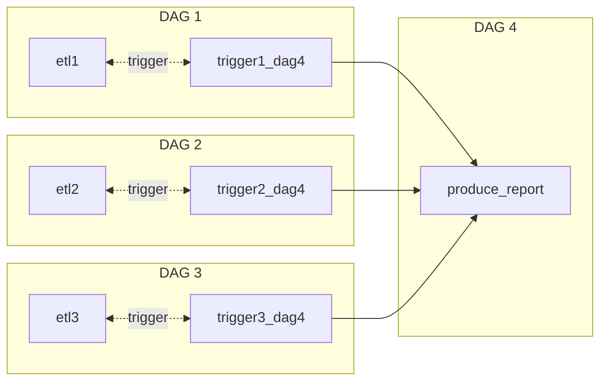

<!-- omit in toc -->
# Introduction
Operators are commonly used in Airflow and play an important role to realize tasks. Therefore, many types and arguments of operators are developing.

<br />

<!-- omit in toc -->
# Table of Contents
- [Fundamental Concepts](#fundamental-concepts)
  - [1. API](#1-api)
  - [2. XCom](#2-xcom)
- [Operators](#operators)
  - [1. PythonOperator](#1-pythonoperator)
  - [2. EmptyOperator](#2-emptyoperator)
  - [3. TriggerDagRunOperator](#3-triggerdagrunoperator)
  - [4. SimpleHttpOperator](#4-simplehttpoperator)
  - [5. Operators for Cloud Servers](#5-operators-for-cloud-servers)
  - [6. Operators for running a heavy work](#6-operators-for-running-a-heavy-work)
  - [7. DockerOperator](#7-dockeroperator)
    - [7.1. auto_remove](#71-auto_remove)
    - [7.2. docker_url](#72-docker_url)
- [Rules of Tasks](#rules-of-tasks)
  - [1. atomicity](#1-atomicity)
  - [2. Idempotent](#2-idempotent)
    - [2.1. How to achieve it?](#21-how-to-achieve-it)
- [Technical Plans](#technical-plans)
  - [1. Is the data processed again at some other time in the future?](#1-is-the-data-processed-again-at-some-other-time-in-the-future)
  - [2. How do I receive the data? Frequency, size, format, source type](#2-how-do-i-receive-the-data-frequency-size-format-source-type)
  - [3. What are we going to build with the data](#3-what-are-we-going-to-build-with-the-data)

<br />

# Fundamental Concepts

## 1. API
* an interface to connect and send requests to other services
* e.g. API of cloud servers in Python
  |Cloud Server| API|
  |:---:|:---:|
  |AWS|boto3|
  |GCP|Cloud SDK|
  |Azure|Azure SDK for Python|

<br />

## 2. XCom
* in a live Airflow setup, any objects returned by an operator are automatically pushed to XCom

<br />

# Operators
* most operators are **installed** by separate **pip packages**
  > apache-airflow-providers-*
* can internally handle the technical implementation
  > that is why many features using operators 

<br />

## 1. PythonOperator
* python_callable <br />
python function which is callable
* template_fields= ['templates_dict', 'op_args', 'op_kwargs']
  
  holds a list of attributes that can be templated. So that, Airflow arguments, e.g. ds, next_ds, can be passed to the templates

  * templates_dict
  * op_args
  * op_kwargs

<br />

## 2. EmptyOperator
* An Operator does nothing

<br />

## 3. TriggerDagRunOperator


* trigger the next dag to run 
* if backfill, clearing TriggerDagRunOperators does not clear tasks in the triggered DAG, but a new DAG runs
  
<br />

## 4. SimpleHttpOperator
* request http and get the response

<br />

## 5. Operators for Cloud Servers
* an Airflow operator can communicate with the Cloud SDK by giving arguments
* required packages to be installed
  |Cloud|Install|
  |:---:|:---:|
  |AWS| pip install apache-airflow-providers-amazon |
  |GCP| pip install apache-airflow-providers-google |
  |Azure| pip install apache-airflow-providers-microsoft-azure |
  > The implementation of the AWS operator calls copy_object() on boto3

<br />

## 6. Operators for running a heavy work
* Use Spark
  * SparkSubmitOperator
  * SSHOperator
  * SimpleHTTPOperator

## 7. DockerOperator

<br />

### 7.1. auto_remove
* remove the container after completion

<br />

### 7.2. docker_url
* set to Unix socket: requires Docker running on the local machine

<br />

# Rules of Tasks

## 1. atomicity
* should follow atomicity to make sure a task will not produce half work if the task failed. 
  
  e.g. a task includes writing data and sending mails if sending mails fails, but data already is stored in the local directory. 

* Solution
  split tasks into multiple tasks => make sure each task has only one purpose 

<br />

## 2. Idempotent
* if a task is called several times, its output should be identical every time 

<br />

### 2.1. How to achieve it?
* set a flag to **overwrite** destination files
```
Process of overwrite: 
e.g. date columns
1. delete existing data with current date
2. insert data with current date
```
<br />

# Technical Plans
before building a pipeline, having a technical plan is required. Questions of Technical Plans are provided below:

## 1. Is the data processed again at some other time in the future?

## 2. How do I receive the data? Frequency, size, format, source type

## 3. What are we going to build with the data 