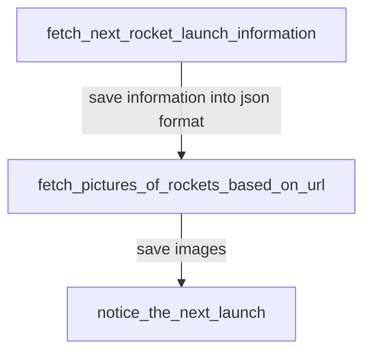

<!-- omit in toc -->
# Introduction
Collect rocket images to fetch next launch

 

<!-- omit in toc -->
# Table of Contents
- [Pipelines](#pipelines)
- [Files Storage](#files-storage)
 

# Pipelines

 

# Files Storage
files can store in tmp/ of scheduler container
> share information between tasks by persisting data to /tmp location