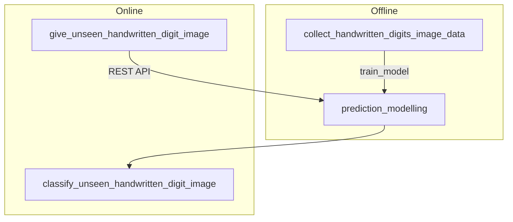
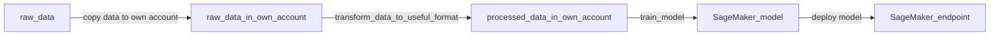

<!-- omit in toc -->
# Table of Contents
- [Introduction](#introduction)
- [Structure](#structure)
  - [Logic Steps of an Offline Part](#logic-steps-of-an-offline-part)

 

# Introduction
The project is to develop a machine learning model, working with AWS S3 buckets and AWS SageMaker.

* Dataset: [MNIST](http://yann.lecun.com/exdb/mnist/) - a database of handwritten digits

* Goal: identify handwritten digits

* Tools: 

 

# Structure

## Logic Steps of an Offline Part

