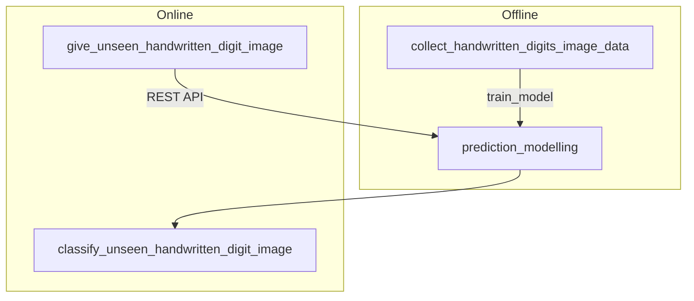
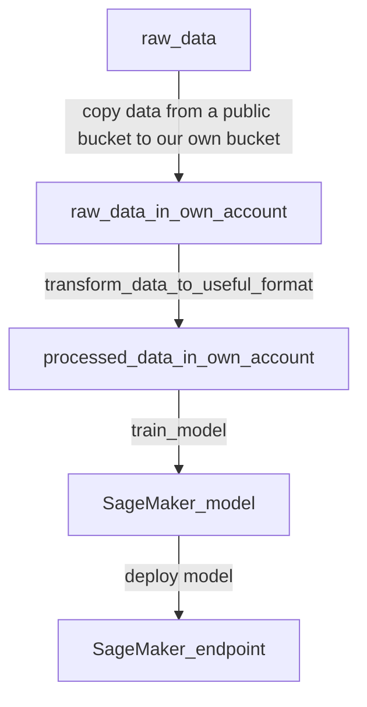
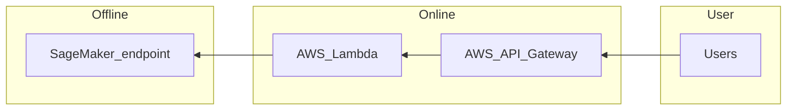

<!-- omit in toc -->
# (WIP)

<!-- omit in toc -->
# Table of Contents
- [Introduction](#introduction)
- [Structure](#structure)
  - [Logic Steps of the Offline Part](#logic-steps-of-the-offline-part)
  - [Steps of the Online Part](#steps-of-the-online-part)
    - [AWS Chalice](#aws-chalice)

 

# Introduction 
The project is to develop a machine learning model, working with AWS S3 buckets and AWS SageMaker.

* Dataset: [MNIST](http://yann.lecun.com/exdb/mnist/) - a database of handwritten digits

* Goal: identify handwritten digits

* Tools: 

 

# Structure

## Logic Steps of the Offline Part

## Steps of the Online Part
* AWS SageMaker endpoint **only** can be accessible via AWS APIS
  * If want HTTP endpoint to SageMaker, **AWS lambda** is required to as a bridge between SageMaker and HTTP endpoint
* API is implemented with AWS Chalice
  > only deploy as one-offs, so not deploy infrastructure

### AWS Chalice
* a Python framework similar to Flask
* automatically generates the API gateway and lambda resources in AWS

